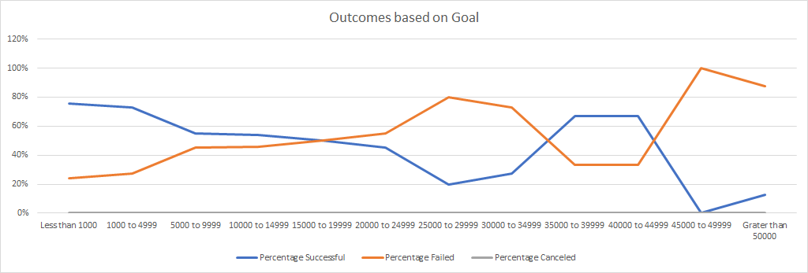

# An Analysis of Kickstarter Campaigns
This is conducting an excel model on Kickstarter campaigns

I am finding that many plays in GB receive no funding.

In the US, campaigns with unrealistic requests get no funding are unsuccessful

I recommend doing a deeper analysis of potential donors to ensure success before running the campaign

### Challenge
My first analysis looks at outcomes based upon the Launch Date for all Theater projects

My second analysis looks at outcomes based upon the goal amount

Here are some findings:
* Successful Kickstarters are for plays that launch in May.  We should dig deeper into what the significance of that month in the play industry is.
* Successful kickstarters with low goals have a higher percentage success rate until 30K.  At that budget, success begins to rise again.  We should either look into having a low Kickstarter budget or research what it is about the >30K plays that makes them successful.
* One item to assess is if we can introduce some efficiencies into our budget to lower our overall goal and increase our chances of success
* One limitation of this analysis is that it groups together theater / plays without regard to genre or any other categorization.  A deeper analysis is needed to. 
